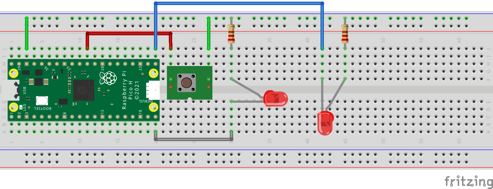

# FreeRTOS SMP Pi Pico MCU Programming in C from a Linux workstation

This is a brief example of FreeRTOS SMP C programming on the Pi Pico Micro 
Controller in the C language from a Linux workstation.

## Prerequisites

- Pi Pico MCU.
- 300 ohm resistors
- LEDs
- USB cable to connect the Pi Pico to the workstation.
- Linux workstation (Fedora 37 was used in the intro).
- Prototyping breadboard.
- Hookup wire.

## Reference Links

- Fedora Linux: [https://getfedora.org/](https://getfedora.org/)
- Raspberry Pi Pico: [https://www.raspberrypi.com/products/raspberry-pi-pico/](https://www.raspberrypi.com/products/raspberry-pi-pico/)
- Pi Pico SDK: [https://github.com/raspberrypi/pico-sdk](https://github.com/raspberrypi/pico-sdk)
- FreeRTOS: [https://www.freertos.org/index.html](https://www.freertos.org/index.html)
  - FreeRTOS [TaskCreate](https://www.freertos.org/a00125.html)


## Workstation Setup

The Linux workstation will require some software packages installed
before developing an application for the Pi Pico. You can use your
favored editor and terminal application, but you will also need *git*, *cmake*, and *g++*.

(Fedora 37 install command)

> sudo dnf install git cmake g++

The ARM cross compilers and libraries are also needed to compile 
and link binaries for the ARM processor on the Pi Pico.

(Fedora 37 install commands)

> sudo dnf install arm-none-eabi-gcc-cs

> sudo dnf install arm-none-eabi-gcc-cs-c++

> sudo dnf install arm-none-eabi-newlib


## Clone Pi Pico SDK

Create a project folder in your home directory where the work will be performed.
In this example we will be using the working directory named *Embedded*.

> cd ~

> mkdir Embedded

> cd Embedded

The Pi Pico SDK can be cloned from the raspberrypi github
repository.

(Clone pico-sdk project and update submodules)

> git clone https://github.com/raspberrypi/pico-sdk

> cd pico-sdk

> git submodule update --init

Return to the project directory and export the path 
environment variable for the pico-sdk.

> cd ..

> export PICO_SDK_PATH=~/Embedded/pico-sdk/


## Clone FreeRTOS

Execute git commands from the project folder to download and setup the 
FreeRTOS source code.

> git clone https://github.com/FreeRTOS/FreeRTOS-Kernel.git

> cd FreeRTOS-Kernel/

The SMP branch is required to support multicore processing on the PI Pico.

> git checkout smp


## LED Blink

The Pi Pico board includes an integrated LED that is tied 
to GPIO 25 on the board. We will use this LED in a new blink 
project.

We will add two LEDs connected to GPIO 15 and 16 with current 
limiting resistors (300 ohms) connecting the cathode of the LED 
to ground.

[Pi Pico pinout](https://datasheets.raspberrypi.com/pico/Pico-R3-A4-Pinout.pdf)




### Project Directory

Create the directory for the blink project and enter directory.

> mkdir pi-pico-linux-c-freertos

> cd pi-pico-linux-c-freertos


### Configure cmake

Create the CMakeLists.txt file for the project and edit.

> touch CMakeLists.txt

(edit file)
```
cmake_minimum_required(VERSION 3.12)

set(PICO_SDK_PATH $ENV{PICO_SDK_PATH})
set(FREERTOS_KERNEL_PATH $ENV{FREERTOS_KERNEL_PATH})

include(${PICO_SDK_PATH}/external/pico_sdk_import.cmake)
include(${FREERTOS_KERNEL_PATH}/portable/ThirdParty/GCC/RP2040/FreeRTOS_Kernel_import.cmake)

project(blink)
set(CMAKE_C_STANDARD 11)
set(CMAKE_CXX_STANDARD 17)

pico_sdk_init()

add_library(freertos STATIC
  ${FREERTOS_KERNEL_PATH}
  ${FREERTOS_KERNEL_PATH}/portable/ThirdParty/GCC/RP2040/port.c
)

target_include_directories(freertos PUBLIC
  .
  ${FREERTOS_KERNEL_PATH}/include
  ${FREERTOS_KERNEL_PATH}/portable/ThirdParty/GCC/RP2040/include
)

target_link_libraries(freertos
  FreeRTOS-Kernel
  FreeRTOS-Kernel-Heap3
  pico_stdlib
)

add_executable(blink blink.c)

pico_add_extra_outputs(blink)
target_link_libraries(blink pico_stdlib freertos)

```


### Project source code

Create the blink.c source file and edit with the following
source code.

> touch blink.c

(edit file)
```c
/*
 * LED blink with FreeRTOS
 */
#include <FreeRTOS.h>
#include <task.h>
#include "pico/stdlib.h"

#define LED_PIN 25
#define LED2_PIN 15
#define LED3_PIN 16

// function to continuously blink LED
void blink () {
  while (true) {
    gpio_put(LED_PIN, 0);
    sleep_ms(2000);
    gpio_put(LED_PIN, 1);
    sleep_ms(2000);
  }
}

// function to continuously blink LED2
void blink2 () {
  while (true) {
    gpio_put(LED2_PIN, 0);
    sleep_ms(200);
    gpio_put(LED2_PIN, 1);
    sleep_ms(200);
  }
}

// function to continuously blink LED3
void blink3 () {
  while (true) {
    gpio_put(LED3_PIN, 0);
    sleep_ms(100);
    gpio_put(LED3_PIN, 1);
    sleep_ms(100);
  }
}


int main()
{
    stdio_init_all();

    gpio_init(LED_PIN);
    gpio_set_dir(LED_PIN, GPIO_OUT);
    gpio_init(LED2_PIN);
    gpio_set_dir(LED2_PIN, GPIO_OUT);
    gpio_init(LED3_PIN);
    gpio_set_dir(LED3_PIN, GPIO_OUT);

    xTaskCreate(blink, "LED Task 1", 256, NULL, 1, NULL);
    xTaskCreate(blink2, "LED Task 2", 256, NULL, 1, NULL);
    xTaskCreate(blink3, "LED Task 3", 256, NULL, 1, NULL);

    vTaskStartScheduler();

    while (true)
        ;
}
```


### Build project

Create the build directory and build the project.

> mkdir build

> cd build

> cmake ..

> make

At this point the build directory should contain all 
the build files including the blink.uf2 file for the 
Pi Pico.


### Copy blink.uf2 to Pi Pico

Connect the USB cable to the Linux workstation, and
while holding down the *bootsel* button on the Pi Pico 
connect the USB cable to the Pi Pico.

After a moment the Pi Pico should be mounted as a USB 
mass storage device on your workstation.

(example listing of mounted Pi Pico)

> ls /run/media/burnin/RPI-RP2/

> INDEX.HTM  INFO_UF2.TXT

Copy the blink.uf2 file to the Pi Pico USB mass 
storage mount point.

> cp blink.uf2 /run/media/burnin/RPI-RP2/

Once the file is copied the Pi Pico should reset and 
begin running the new blink application. The green LED
should be blinking at 2 second intervals.